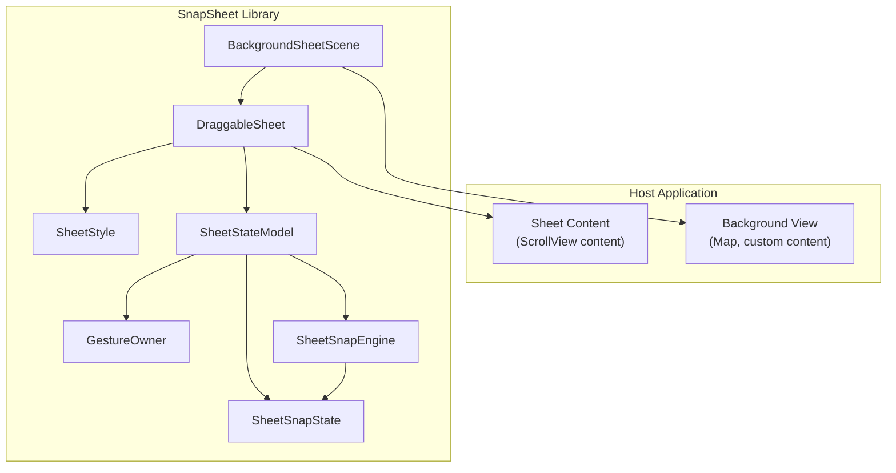
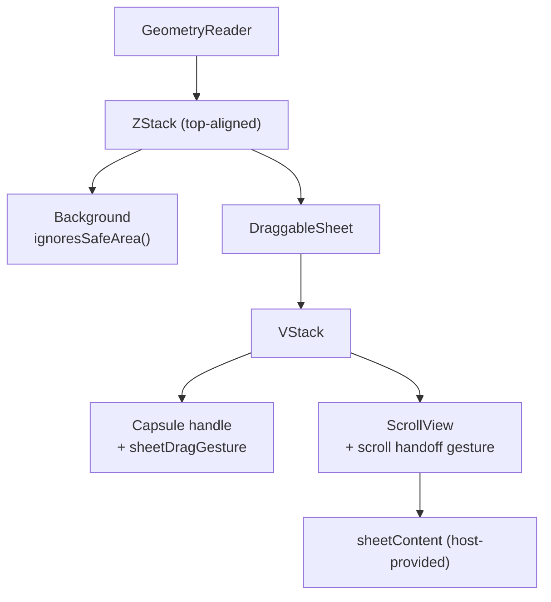
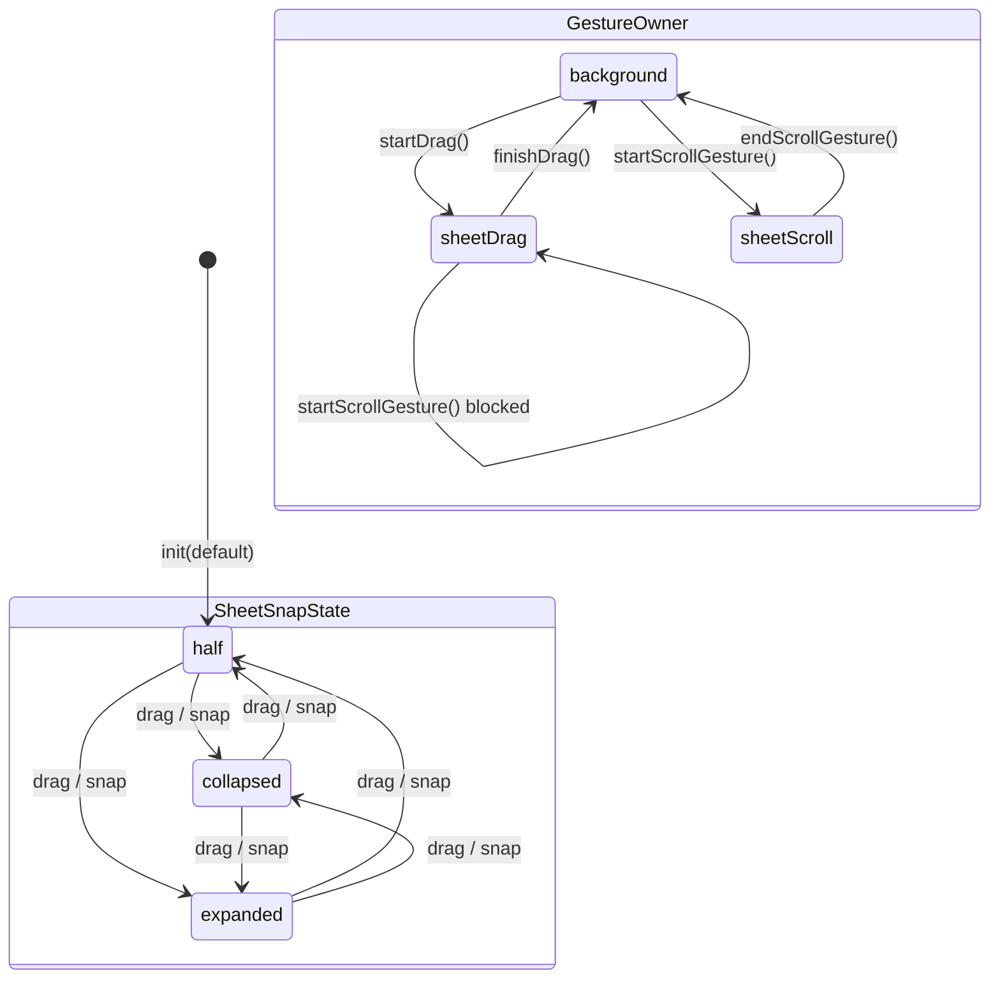
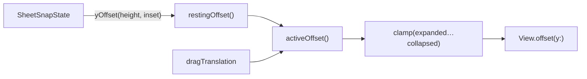
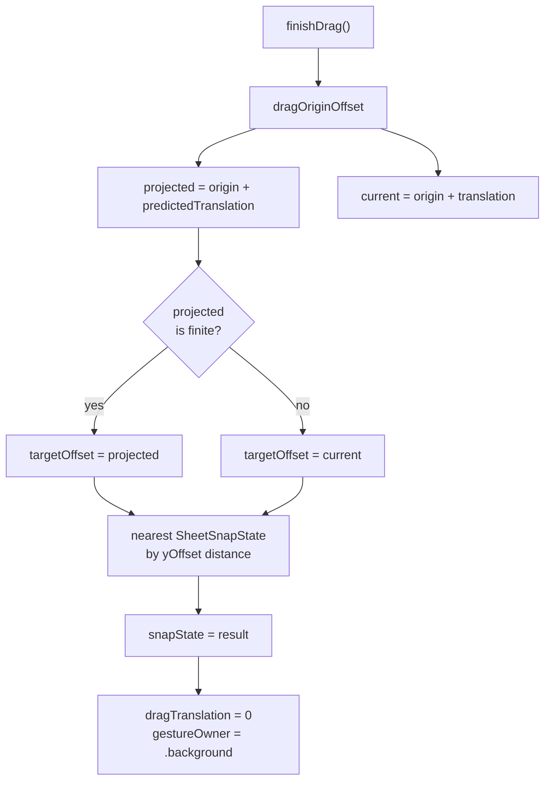
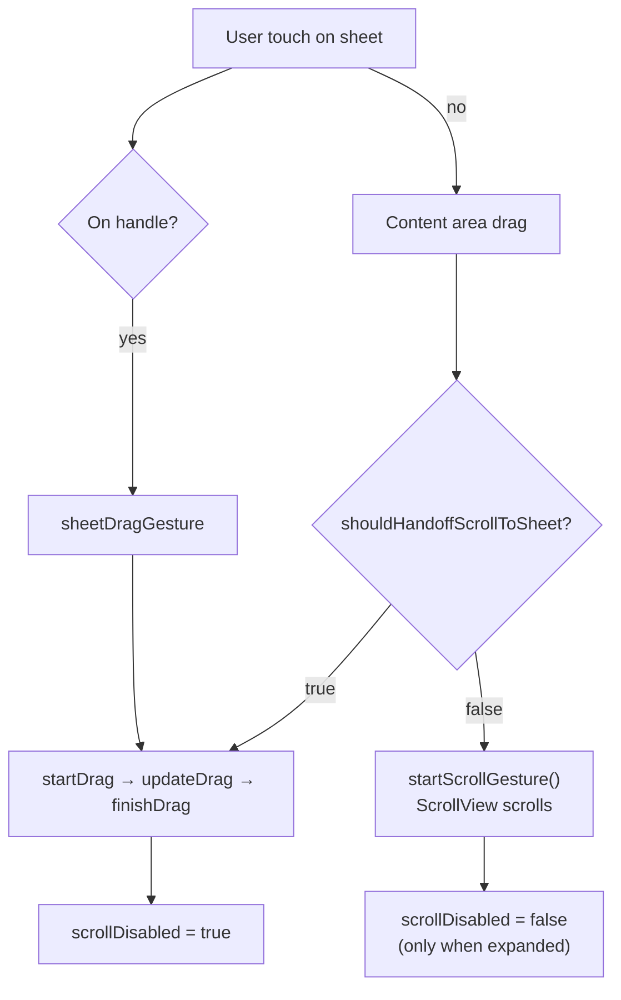

# SnapSheet Architecture

This document describes how SnapSheet is structured, how data flows through the library at runtime, and how gestures are coordinated between the background, sheet drag, and sheet scroll.

## Component Overview



## View Hierarchy

`BackgroundSheetScene` is the primary integration point. It owns layout geometry and composes two layers:



| Layer | Responsibility |
|-------|----------------|
| `GeometryReader` | Supplies container height and bottom safe-area inset |
| Background | Full-screen host content; never handles sheet gestures |
| `DraggableSheet` | Material chrome, y-offset, handle drag, scroll handoff |
| `ScrollView` | Host sheet content; disabled unless expanded and not dragging |

## State Model

`SheetStateModel` is an `@MainActor @Observable` class that acts as the single source of truth for sheet position and gesture ownership.



### Published state

| Property | Purpose |
|----------|---------|
| `snapState` | Current resting detent (`.collapsed`, `.half`, `.expanded`) |
| `dragTranslation` | In-progress vertical drag offset; `0` when idle |
| `lastDragVelocityY` | Inferred flick velocity from the last completed drag |
| `gestureOwner` | Active gesture: `.background`, `.sheetDrag`, or `.sheetScroll` |
| `contentOffsetY` | Vertical scroll offset of inner sheet content |

### Offset pipeline



## Snap Resolution

When a drag ends, `SheetSnapEngine` resolves the nearest detent to the **projected end offset**:



### Detent offset formulas

All offsets are measured from the **top of the screen** (applied via `View.offset(y:)`).

| Detent | Formula |
|--------|---------|
| `.expanded` | `max(70, height × 0.12)` |
| `.half` | `height × 0.48` |
| `.collapsed` | `max(height × 0.76, height − 180 − bottomInset)` |

Smaller offsets mean the sheet is higher on screen (more expanded).

## Gesture Coordination

SnapSheet runs two drag recognizers on the sheet: a dedicated handle gesture and a simultaneous content-area gesture that competes with `ScrollView` scrolling.



### Scroll handoff rules

```
shouldHandoffScrollToSheet(dragTranslationY):

  if snapState != .expanded → true   (always move sheet)
  else → contentOffsetY ≤ 1 AND dragTranslationY > 0
```

| Sheet state | Scroll position | Drag direction | Result |
|-------------|-----------------|----------------|--------|
| Not expanded | any | any | Sheet moves |
| Expanded | top (`≤ 1pt`) | down (`> 0`) | Sheet moves |
| Expanded | top | up | Scroll content |
| Expanded | scrolled | down | Scroll toward top |
| Expanded | scrolled | up | Scroll content |

## File Map

```
Sources/SnapSheet/
├── BackgroundSheetScene.swift   # Top-level scene (background + sheet)
├── DraggableSheet.swift         # Sheet UI, gestures, animations
├── SheetStateModel.swift        # Observable state machine
├── SheetSnapState.swift         # Detent definitions and yOffset math
├── SheetSnapEngine.swift        # Nearest-detent snap resolver (internal)
├── SheetStyle.swift             # Visual configuration
└── GestureOwner.swift           # Gesture ownership enum

Tests/SnapSheetTests/
└── SnapSheetTests.swift         # Unit tests for state, snap, and offsets

Examples/SnapSheetDemo/
└── …                            # Demo iOS app (not part of the library)
```

## Extension Points

| Goal | Approach |
|------|----------|
| Custom background | Provide any `View` to `BackgroundSheetScene` background closure |
| Custom sheet content | Provide any `View` to the sheet content closure |
| Custom chrome | Pass a custom `SheetStyle` |
| Read snap state externally | Share a `SheetStateModel` instance with the scene |
| Programmatic detent change | Set `sheetModel.snapState` directly |
| Low-level layout control | Use `DraggableSheet` directly with your own `GeometryReader` |

## Dependencies

SnapSheet has **zero third-party dependencies**. It uses only Apple frameworks:

- **SwiftUI** — views, gestures, animations
- **Observation** — `@Observable` state
- **CoreGraphics** — offset math (via `SheetSnapEngine`)
